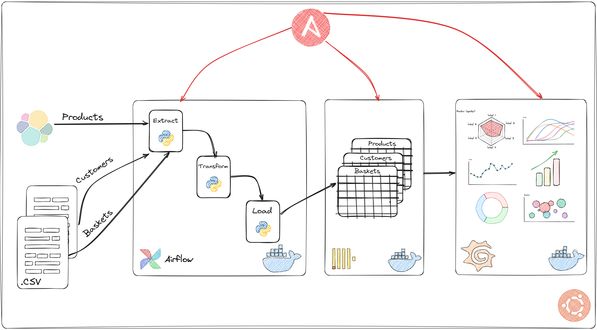
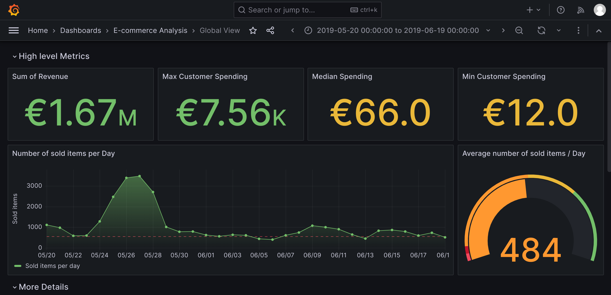
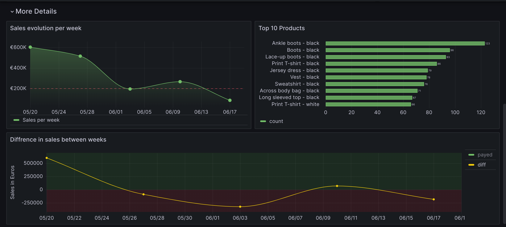

# E-commerce-Sales-Analysis-Pipeline
Create an advanced data engineering pipeline that processes and analyzes sales data from an e-commerce website using Apache Airflow for workflow management and ClickHouse as the high-performance data warehouse.

# Project Tasks:
## 1. Data Collection:
- Obtain or generate a sample dataset of e-commerce sales data. Include information such as transaction date, product sold, quantity, price, customer details, etc.
## 2. Data Preprocessing:
- Cleanse and preprocess the data to handle missing values, outliers, and data inconsistencies.
## 3. Data Warehouse Setup with ClickHouse:
- Install and configure ClickHouse, an open-source columnar database management system designed for high-performance analytics.
- Create tables and optimize the schema for efficient data storage and querying.
## 4. ETL Pipeline with Apache Airflow:
- Set up Apache Airflow to manage the end-to-end ETL pipeline.
- Design and implement Airflow DAGs (Directed Acyclic Graphs) to orchestrate data extraction, transformation, and loading processes.
- Schedule DAG runs to process data at regular intervals (e.g., daily or weekly).
## 5. Data Visualization:
- Use Grafana and other python libraries to create insightful visualizations, showcasing sales trends, customer behavior, and other important metrics.
  
  
  
## 6. Automation with Ansible:
- Implement Ansible playbooks to automate the deployment and configuration of the ClickHouse database and Apache Airflow on a server or cloud platform.
- Use Ansible to manage the project's infrastructure and dependencies efficiently.
## 7. Error Handling and Logging:
- Incorporate error handling mechanisms within the Airflow DAGs to handle failures gracefully and send notifications if any issues occur.
- Implement logging to track the pipeline's performance and troubleshoot potential problems.
## 8. Documentation:
- Provide clear and detailed documentation of the project, including instructions for setting up the environment, running Airflow DAGs, and accessing ClickHouse data.

## 9. Bonus Enhancements:
- Implement data streaming capabilities using Apache Kafka and process real-time data updates.
- Deploy the entire data engineering pipeline on cloud services like AWS or Azure using infrastructure-as-code (IaC) tools like Terraform.
- Implement more complex analytics, such as customer lifetime value or cohort analysis.

By incorporating Apache Airflow, ClickHouse, and Ansible automation, we create a scalable, efficient, and automated data engineering project. This project aims to manage relativily complex workflows, leverage high-performance databases, and automate essential processes. Happy coding!
