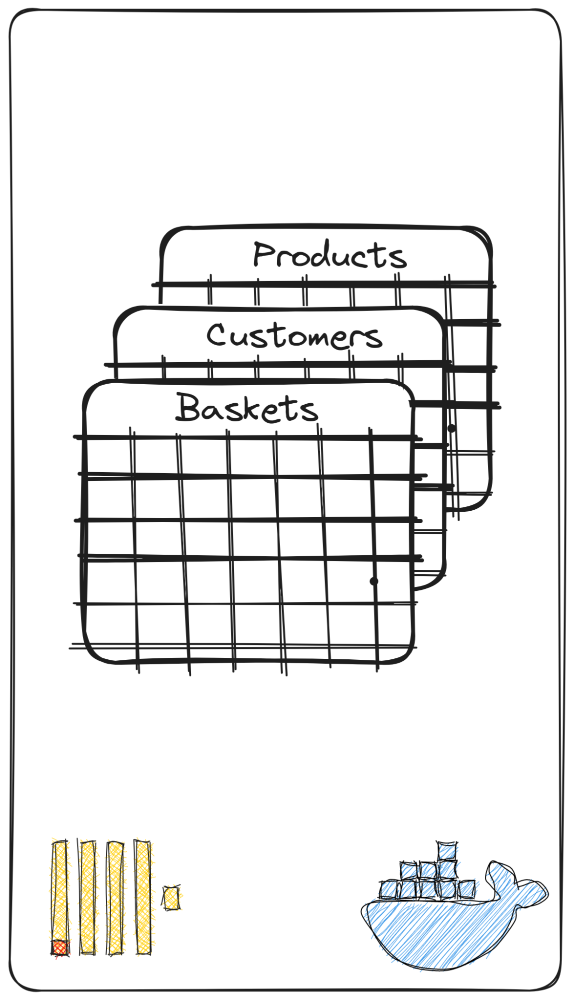

# Clickhouse for data Storing and Analysis

[Clickhouse](https://clickhouse.com/) is an open-source column-oriented DBMS for online analytical processing that allows users to generate analytical reports using SQL queries in real-time.


## Clikhouse in this project

In this project, Clickhouse is used to store customer and products data. It is also Connected to [Grafana](https://grafana.com/grafana/plugins/grafana-clickhouse-datasource/) to build a dahboard.

The image below, shows that Clickhouse instance is deployed in Docker. 3 tables are created to store the data. Description of the tables in the next section.


## Data schema

This section describes the tables used.

### Products

| Field | Type | Description |
|-------|------|-------------|
|base_price  |  Decimal32(2)    |             |
|discount_percentage    |   Decimal32(2)   |             |
|quantity    |   UInt16   |             |
|manufacturer    |   LowCardinality(Nullable(String))   |             |
|tax_amount   |   Decimal32(2)   |             |
|category    |   Enum(...)   |             |
|   product_id    |   UInt32   |             |
|   sku    |   String   |             |
|    taxless_price   |   Decimal32(2)   |             |
|    unit_discount_amount   |   Decimal32(3)   |             |
|    min_price   |   Decimal32(2)   |             |
|    discount_amount   |   Decimal32(2)   |             |
|    created_on   |   DateTime64(3)   |             |
|    product_name   |   Nullable(String)   |             |
|    price   |   Decimal32(2)   |             |
|  taxful_price |   Decimal32(2)|        |
|  base_unit_price |Decimal32(2)|        |


Below the clickhouse query that create this table:

```
CREATE TABLE IF NOT EXISTS products (base_price Decimal32(2), discount_percentage Decimal32(2), quantity UInt16, manufacturer LowCardinality(Nullable(String)),
tax_amount Decimal32(2), product_id UInt32, category Enum('Men\\'s Clothing', 'Women\\'s Clothing','Women\\'s Shoes','Men\\'s Accessories', 'Men\\'s Shoes','Women\\'s Accessories'), sku String, taxless_price Decimal32(2),
unit_discount_amount Decimal32(3), min_price Decimal32(2), discount_amount Decimal32(3),
created_on DateTime64(3), product_name Nullable(String), price Decimal32(2), taxful_price Decimal32(2),
base_unit_price Decimal32(2)) ENGINE MergeTree ORDER BY product_id
```

### Customers

| Field | Type | Description |
|-------|------|-------------|
|   customer_id    |   UInt32   |             |
|    sex   |   Enum('male' = 1, 'female' = 2,'UNKNOWN'= 3)   |             |
|     customer_age  |   UInt64   |             |
|    tenure   |   UInt8   |             |

Below the clickhouse query that create this table:

```
CREATE TABLE IF NOT EXISTS customers (customer_id UInt32, sex Enum('male' = 1, 'female' = 2,'UNKNOWN'= 3), customer_age UInt64, tenure UInt8) ENGINE MergeTree ORDER BY customer_id
```

### Baskets


| Field | Type | Description |
|-------|------|-------------|
|   customer_id    |   UInt32   |             |
|    product_id   |   UInt32   |             |
|   basket_date    |    Date  |             |
|    basket_count   |  UInt8    |             |

Below the clickhouse query that create this table:

```
CREATE TABLE IF NOT EXISTS baskets (customer_id UInt32, product_id UInt32, basket_date Date, basket_count UInt8) ENGINE MergeTree ORDER BY (customer_id, product_id)
```

### Sales Materlized View

[Materialized views](https://clickhouse.com/docs/en/sql-reference/statements/create/view#materialized-view) store data transformed by the corresponding SELECT query.

the MV sales_mv, sums the total sales per customer per date and put forward a view of the data that can be used often to showcases some information.

First we create the table that will hold the data of the view, called sales:
```
query="""
CREATE TABLE sales
(
    `customer_id` UInt32,
    `basket_date` Date,
    `sales` AggregateFunction(sum, Decimal(9, 2))
)
ENGINE = AggregatingMergeTree
ORDER BY (customer_id, basket_date)
"""
```

And then we create the __MATERIALIZED VIEW__ sales_mv :
```
join="""CREATE MATERIALIZED VIEW sales_mv
TO sales
AS
SELECT 
    customer_id,
    b.basket_date AS basket_date,
    sumState( taxful_price * basket_count ) AS sales   
FROM 
    baskets as b Join products as p 
    on b.product_id=p.product_id
GROUP BY
    customer_id,
    basket_date

"""
```

Since __MATERIALIZED VIEW__ are populated when new data are inserted, running the below query aims to do a manual backfilling.
```
populating="""INSERT INTO sales
SELECT 
    customer_id,
    b.basket_date AS basket_date,
    sumState( taxful_price * basket_count ) AS sales   
FROM 
    baskets as b Join products as p 
    on b.product_id=p.product_id
GROUP BY
    customer_id,
    basket_date
"""
```